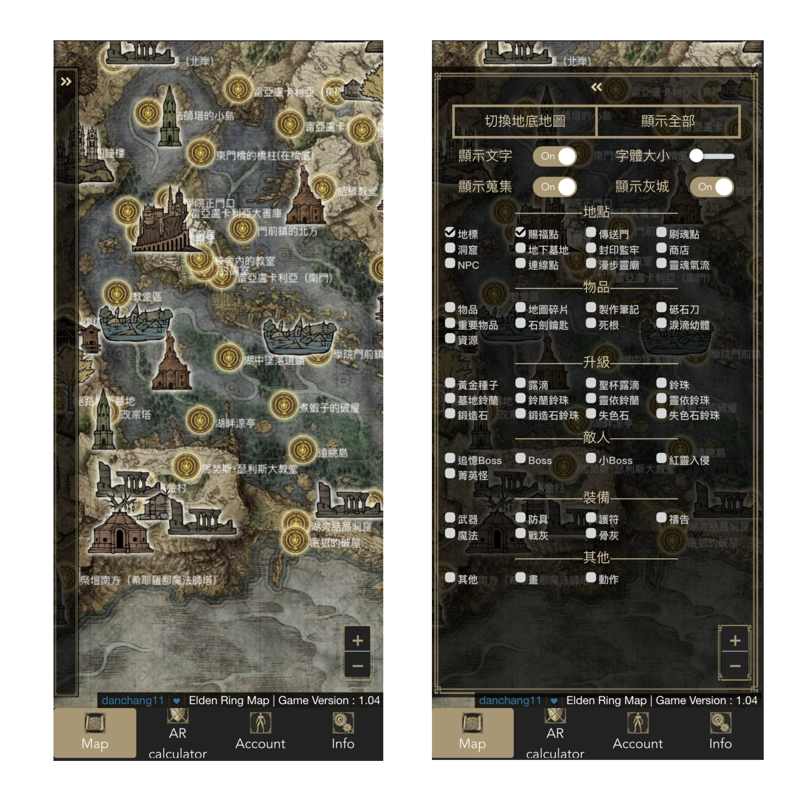

# zh-TW.EldenRingMap

- MySQL Schema 在 databaseSchema.sql
- eldenringMarker_en2zhtw.xlsx 可以找到marker type中英對照表


## Tech Stack
- Front : Vue3 + leaflet.js
- Backend : Express.js (Typescript) + MySQL
- Infra : Nginx

## 功能
1. 艾爾登法環地圖：與現有其他Online Map不同，透過Canvas取代直接在DOM上的操作，大大提昇效能。//TODO:登入可標記已收集。 
2. 裝備配點計算機 (AR Calculator) // TODO:Frontend

<hr/>
## PC截圖


## Mobile截圖


<hr/>

## APIs for Frontend Testing
### Markers - 都是GET （測試階段先用.json充當db）
##### 取得所有markers
```
127.0.0.1:3150/test/api/all
```

##### 取得特定type markers
```
127.0.0.1:3150/test/api/:type
```
  - e.g:
    ```
    127.0.0.1:3150/test/api/SiteOfGrace
    ```


- Marker的interface
```
interface DataRow {
    id: number,
    type: string,
    name: string,
    desc: string,
    lng: string,
    lat: number,
    is_underground: number,
    position: number,
    is_achivement: number,
    is_lock: number,
    delete_request: number,
    likecount: number,
    dislikecount: number,
    ip: string,
    is_deleted: number,
    create_date: string,
    update_date: string
}
```

### User - POST - 登入註冊等等
登入：
```
127.0.0.1:3150/auth/login
```
Body : 
```
{
    "email":"yoyoyo@gmail.com",
    "password":"To26292661@"
}
```
登入成功：
```
status:200
{
    "token": "xxxxx"
    "message": "Logged in successfully"
}
```
token為 JWT
--------------------
註冊：
```
127.0.0.1:3150/auth/register
```
Body : 
```
{
    "email":"yoyddoyo@gmail.com",
    "username":"test123",
    "password":"test"
}
```
註冊成功：
```
status:201
{
    "message": "User Created Successfully",
    "status": 201
}
```
