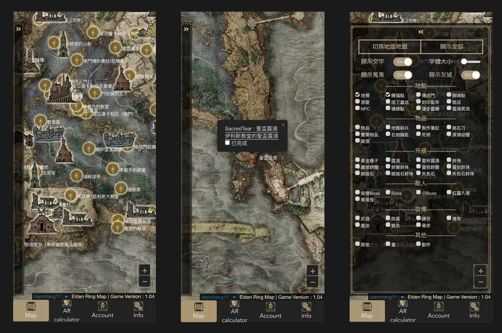

# EldenRingOnlineTools
Elden Ring Online Map and Attack Rating(AR) calculator / 艾爾登法環成就地圖&攻擊分數計算幾
## Tech Stack
- Front : Vue3 + leaflet.js
- Backend : Express.js (Typescript) + MySQL
- Infra : Nginx

## Features
1. Elden Ring Map : Different from other online map, I render all the markers with HTML5 Canvas instead of rendering each markers on DOM. It gives the application huge performance improved. **TODO : Collection and award system**
2. Attack Rating Calculator : It calculates all the attack rating states such as physical attack, magic attack and etc, by the STR, INT and etc of the player. It let user to see how the stats change with attributes in real time. **TODO : Frontend**


<hr/>

## Desktop Screenshot


## Mobile Screenshot


<hr/>

## APIs for Frontend Testing
### Markers
##### get all markers
```
127.0.0.1:3150/test/api/all
```

##### get specific type of markers
```
127.0.0.1:3150/test/api/:type
```
  - e.g:
    ```
    127.0.0.1:3150/test/api/SiteOfGrace
    ```


- The interface of marker
```
interface DataRow {
    id: number,
    type: string,
    name: string,
    desc: string,
    lng: string,
    lat: number,
    is_underground: number,
    position: number,
    is_achivement: number,
    is_lock: number,
    delete_request: number,
    likecount: number,
    dislikecount: number,
    ip: string,
    is_deleted: number,
    create_date: string,
    update_date: string
}
```

### User - POST - Login and Register
Login：
```
127.0.0.1:3150/auth/login
```
Body : 
```
{
    "email":"yoyoyo@gmail.com",
    "password":"testtest"
}
```
Login sucessfully response：
```
status:200
{
    "token": "xxxxx"
    "message": "Logged in successfully"
}
```
token is JWT
--------------------
Register：
```
127.0.0.1:3150/auth/register
```
Body : 
```
{
    "email":"yoyddoyo@gmail.com",
    "username":"test123",
    "password":"test"
}
```
Register sucessfully：
```
status:201
{
    "message": "User Created Successfully",
    "status": 201
}
```


## Notes
- the schema of MySQL is in databaseSchema.sql
- You can find the english-chinese in eldenringMarker_en2zhtw.xlsx 

## Copyright
Copyright (c) 2022-2023 Daniel Tschang <danchang11.95@gmail.com>. All rights reserved.
